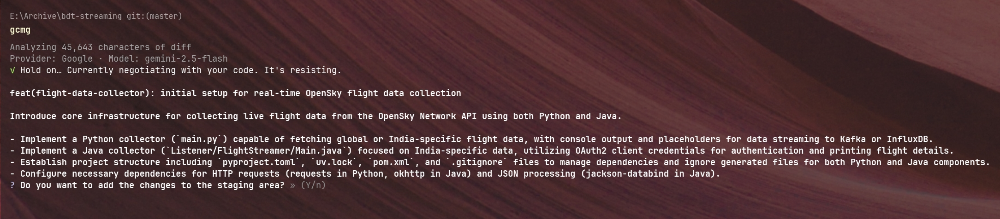
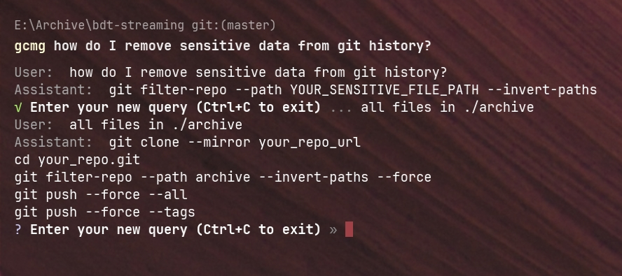

<center> 

<h1>Git Commit Message Generator </h1>

An opinionated commit message generator for git.

[](https://badge.fury.io/js/gcmg)
[](https://opensource.org/licenses/MIT)
[](https://nodejs.org/)

 </center>

---

## Installation

```bash
npm i -g gcmg@latest
```

## Usage

### Generate a commit message

```bash
gcmg # or git msg
```

<center> Terminal Output </center>
<br>
<center>

</center>

### Ask a question about git

```bash
gcmg how do I remove sensitive data from git history?
```

<center>

</center>

### Follows a proven structure

Follows the [Conventional Commits](https://www.conventionalcommits.org/en/v1.0.0/) format.

example:

```bash
feat!: send an email to the customer when a product is shipped
```

## Configuration

Run `gcmg config` to configure

```bash
$ gcmg config

? Select your preferred AI provider » - Use arrow-keys. Return to submit.
>   OpenAI
    Anthropic
    Google
    Custom OpenAI Based Provider

```

> If you are using a custom OpenAI based provider, you need to enter the model ID and the base URL.

Select your model from the list of available models.

```bash
√ Select your preferred AI provider » Anthropic
? Select your preferred model »
>   claude-sonnet-4.6
    claude-opus-4.6
    claude-opus-4.5
    claude-haiku-4.5
    claude-sonnet-4.5
    claude-opus-4.1
    claude-opus-4
    claude-sonnet-4
    claude-3.7-sonnet
  ↓ claude-3.7-sonnet:thinking
```

> Uses openrouter to fetch the list of available models. Check out [generate-models.ts](./scripts/generate-models.ts) to see how it works.

## License

This project is licensed under the **MIT License** - see the [LICENSE](LICENSE) file for details.

---

[Report Bug](https://github.com/yashraj-n/gcmg/issues) · [Request Feature](https://github.com/yashraj-n/gcmg/issues) · [Discussions](https://github.com/yashraj-n/gcmg/discussions)
