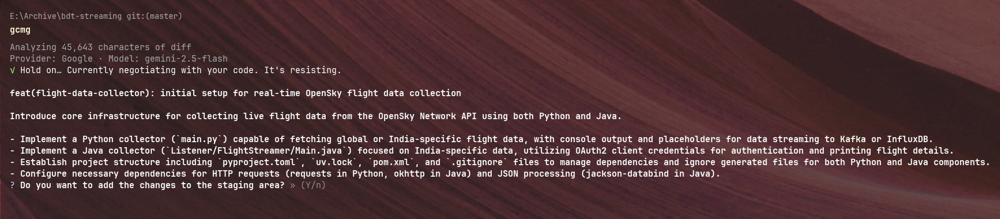
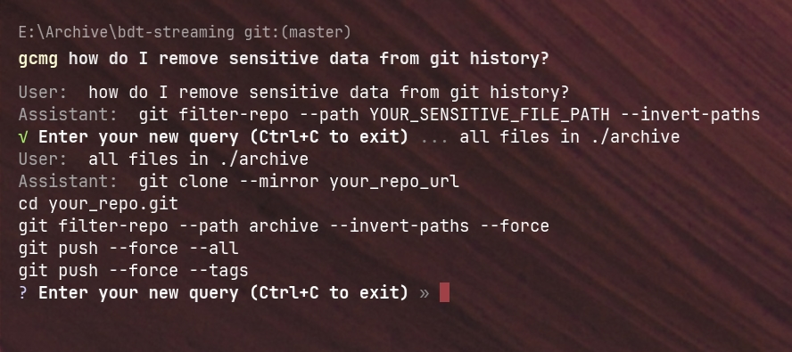

<center> 

<h1>Git Commit Message Generator </h1>

An opinionated commit message generator for git.

[](https://badge.fury.io/js/gcmg)
[](https://opensource.org/licenses/MIT)
[](https://nodejs.org/)

 </center>

---

## Installation

```bash
npm i -g gcmg@latest
```

## Usage

### Generate a commit message

```bash
gcmg # or git msg
```

<center> Terminal Output </center>
<br>
<center>

</center>

### Ask a question about git

```bash
gcmg how do I remove sensitive data from git history?
```

<center>

</center>

### Follows a proven structure

Follows the [Conventional Commits](https://www.conventionalcommits.org/en/v1.0.0/) format.

example:

```bash
feat!: send an email to the customer when a product is shipped
```

## Configuration

Run `gcmg config` to configure. On first setup you choose the interactive UI:

```bash
$ gcmg config

? Preferred interactive UI
>   TUI
    CLI

? Select your preferred AI provider » - Use arrow-keys. Return to submit.
>   OpenAI
    Anthropic
    Google
    OpenRouter
    Custom OpenAI Based Provider

```

- **TUI** (default): full-screen [OpenTUI](https://opentui.com) interface (requires **Bun 1.3+** or **Node ≥ 26.4** with experimental FFI).
  Install: `bun add @opentui/core` or `npm install @opentui/core`
- **CLI**: lightweight vim-style bottom key bar (works on any Node ≥ 18).

### Keyboard shortcuts (TUI & CLI)

Both interactive modes provide a responsive, single-line ungrouped keybar:

| Key | Action | Description |
|---|---|---|
| `c` | **Copy** | Copies the current commit message variant to your system clipboard |
| `e` | **Edit** | Edit message in place (`Ctrl+S` to save, `Esc` to cancel) |
| `r` | **Regenerate** | Prompts for an optional hint, or press `Enter`/`Esc` to regenerate without hints |
| `n` / `p` | **Next / Prev** | Cycle between up to 3 generated commit message variants |
| `f` | **Files** | Interactive file picker to toggle individual files staged/unstaged |
| `s` | **Commit** | Commit only currently staged changes |
| `a` | **Stage All + Commit** | Stage all changes and commit with current message |
| `u` | **Commit + Push** | Commit and push to remote (automatically sets upstream branch if missing) |
| `y` | **Yolo Mode** | Toggle Yolo preference (persisted to config); press `Enter` to stage all, commit & push |
| `d` | **Dry-run** | Print current message to terminal and exit without committing |
| `h` / `?` | **Help** | Display keyboard reference overlay |
| `q` / `Esc` | **Quit** | Exit cleanly without committing |

### Interactive File Picker (`f`)

Press `f` in either the TUI or CLI to open the file selection checklist:
- `↑` / `↓` (or `k` / `j`) to move between files
- `Space` to toggle file staging (`[✓]` staged, `[ ]` unstaged)
- `a` to toggle all files staged / unstaged
- `Enter` to confirm: staging is updated, unselected files are skipped, and the commit message is regenerated specifically for the selected files!
- `Esc` or `q` to cancel without modifying git index

### Yolo Mode (`y`, `gcmg yolo`, `-y`)

Want to commit and push without stepping through questions?
- Press `y` to toggle Yolo mode ON or OFF. Your preference is automatically saved to `gcmg-config.json`.
- When Yolo mode is ON, press `Enter` to stage all changes, commit, and push in one shot!
- Or run `gcmg yolo` / `gcmg -y` directly from your shell.

### Automatic Git Repository Setup

Running `gcmg` in a folder that hasn't been initialized with Git? Instead of crashing, `gcmg` prompts you to initialize the repository (`git init`) and automatically tracks changes so you can start committing right away.

### CLI Options

```bash
gcmg [query...]              # Generate commit message or ask git questions
gcmg -m, --context <text>    # Provide context/hint for the commit message
gcmg -a, --all               # Stage and diff all files (including unstaged)
gcmg -y, --yolo              # Run in Yolo mode (stage all, commit, push)
gcmg -p, --print             # Print message to stdout and exit (non-interactive / CI)
gcmg --dry-run               # Alias for --print
gcmg yolo                    # Dedicated subcommand for one-shot stage, commit & push
gcmg config                  # Interactive configuration wizard
```

### OpenRouter

OpenRouter gives you access to hundreds of models through a single API key.

- **Free** — `openrouter/free` (free models only, no credits needed)
- **Auto** — `openrouter/auto` (paid smart routing)
- **Custom** — any model ID (e.g. `meta-llama/llama-3.3-70b-instruct:free`)

```bash
√ Select your preferred AI provider » OpenRouter
? OpenRouter mode »
>   Free  — openrouter/free (no credits)
    Auto  — openrouter/auto (paid routing)
    Custom — enter any model ID
```

### Other providers

Select your model from the list of available models.  
`gcmg config` prefers a **live** catalog from OpenRouter (cached for 24 h on your machine) and falls back to the list baked into the package at publish time.

```bash
√ Select your preferred AI provider » Anthropic
? Select your preferred model »
>   claude-sonnet-4.6
    claude-opus-4.6
    ...
```

### Model freshness alerts

Every time you run `gcmg`, it quietly checks whether your configured model is still listed (and not expired) on OpenRouter. If the model has been renamed or retired you will see a short yellow warning in the terminal, e.g.:

```
⚠  Model "gpt-4-turbo" (openai/gpt-4-turbo) is no longer listed on OpenRouter.
   It may have been renamed or retired. Run gcmg config to pick a current model.
```

> If you are using a custom OpenAI based provider, you need to enter the model ID and the base URL.
>
> Build-time model lists are generated by [generate-models.ts](./scripts/generate-models.ts).

## License

This project is licensed under the **MIT License** - see the [LICENSE](LICENSE) file for details.

---

[Report Bug](https://github.com/yashraj-n/gcmg/issues) · [Request Feature](https://github.com/yashraj-n/gcmg/issues) · [Discussions](https://github.com/yashraj-n/gcmg/discussions)
